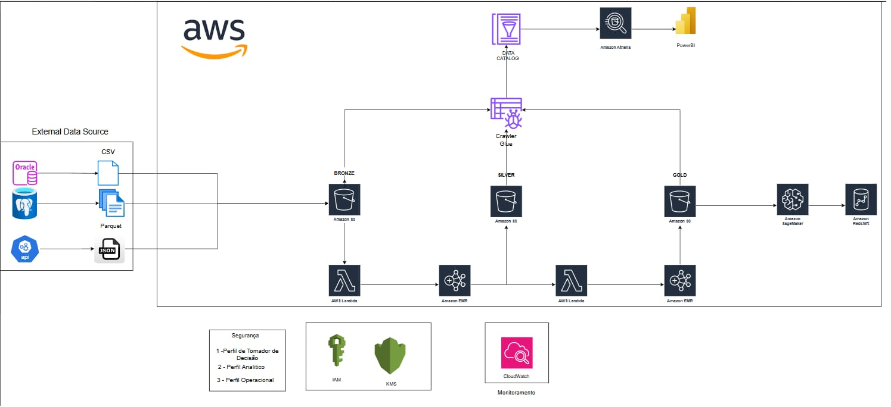

# 🎯 Modelo Behavior Claro - Predição de Risco de Crédito

[](https://www.python.org/)
[](https://aws.amazon.com/)
[]()
[]()
[](LICENSE)

> Modelo de predição de risco de inadimplência para clientes pré-pagos baseado em visão única por CPF utilizando arquitetura Medallion na AWS

---

## 📑 Índice

- [Sobre o Projeto](#-sobre-o-projeto)
- [Problema de Negócio](#-problema-de-negócio)
- [Arquitetura da Solução](#-arquitetura-da-solução)
- [Stack Tecnológico](#-stack-tecnológico)
- [Estrutura do Projeto](#-estrutura-do-projeto)
- [Como Reproduzir](#-como-reproduzir)
- [Pipeline de Dados](#-pipeline-de-dados)
- [Modelagem](#-modelagem)
- [Validação e Métricas](#-validação-e-métricas)
- [Segurança e Governança](#-segurança-e-governança)
- [Resultados](#-resultados)
- [Time](#-time)
- [Documentação Completa](#-documentação-completa)
- [Licença](#-licença)

---

## 🎯 Sobre o Projeto

Este projeto foi desenvolvido durante o **Super Hackathon 2025** pela **PoD Academy** com o objetivo de criar um modelo preditivo de risco de crédito para identificar clientes da base pré-pago da Claro com maior probabilidade de se tornarem inadimplentes.

### Objetivos Principais

- ✅ Construir visão única de cliente por CPF consolidando múltiplas bases
- ✅ Identificar padrões comportamentais de inadimplência
- ✅ Desenvolver modelo behavior reprodutível e escalável
- ✅ Gerar insights acionáveis para estratégias de mitigação de risco
- ✅ Implementar arquitetura moderna e governada na AWS

### Contexto de Negócio

A inadimplência em serviços de telecomunicações representa um desafio crítico para a operação. A capacidade de identificar preventivamente clientes com maior risco permite:

- **Redução de perdas** financeiras por inadimplência
- **Otimização de políticas** de crédito e cobrança hiper-segmentadas
- **Personalização de ofertas** baseada em perfil de risco
- **Melhoria da experiência** do cliente através de abordagens proativas
- **Captura de oportunidades** de negócio (migração pré → pós-pago)

---

## 💼 Problema de Negócio

### Desafio

Identificar, entre os clientes da base pré-pago, quais têm maior probabilidade de se tornarem inadimplentes, permitindo ações preventivas e estratégias de mitigação de risco.

> **"Risco de Crédito é a chance de famílias e empresas NÃO cumprirem com suas obrigações, resultando em perdas."**

### Contexto Estratégico da Claro

**Dimensão do Desafio**:
- 🎯 **50 milhões de assinantes** na base
- 📊 **Taxa de aprovação atual**: 73-74%
- 🎲 **Grupo controle**: ~2% da base (seleção por 6º e 7º dígitos do CPF)
- 🔄 **Análise contínua** influenciada por fatores de mercado, regulação e economia

**Objetivo Estratégico**:
- **Cenário 1**: Aumentar taxa de aprovação **mantendo** inadimplência estável
- **Cenário 2**: Reduzir inadimplência **mantendo** taxa de aprovação estável
- **Ideal**: Ganho incremental em ambas as dimensões através de políticas hiper-segmentadas

### Abordagem

Consolidação de dados cadastrais, comportamentais, de score de crédito e histórico de pagamentos em uma **visão única por CPF**, seguida de modelagem preditiva incremental para classificação de risco.

**Diferenciais da Solução**:
- ✅ **Crédito Telco ≠ Crédito Tradicional**: Uso de dados comportamentais de recarga
- ✅ **Modelagem Incremental**: Avaliação de ganho por fonte de dados
- ✅ **Foco em Oportunidades**: Identificar clientes "escondidos" com bom comportamento
- ✅ **Gestão de Risco como Alavanca**: Transformar controle em captura de negócios

### Case de Sucesso Real

**Situação**: Cliente pré-pago com histórico consistente de recarga, mas sem histórico bancário robusto

**Problema**: Modelo tradicional classificaria como **alto risco** → Cliente negado para pós-pago

**Solução**: Análise de padrão de recarga permite reclassificação de Alto → Médio/Baixo risco

**Resultado**: ✅ Cliente aprovado, ✅ Retenção, ✅ Aumento de receita (pós > pré)

> *"É diferente de crédito pessoal, financiamento... com as informações de recarga eu consigo classificar ou eventualmente reclassificar um cliente que não teria chance de ter pós-pago."*

### Métricas de Sucesso

**Benchmark Estabelecido (Out-of-Time Fev/Mar)**:
- **KS (Kolmogorov-Smirnov)**: 33,1 ⭐ (métrica principal)
- **GINI**: Complementar ao KS
- **Taxa de Aprovação**: ~73-74%
- **Inadimplência**: Baseline do grupo controle

**Métricas de Avaliação**:

| Métrica | Descrição | Objetivo |
|---------|-----------|----------|
| **KS Statistic** | Poder de separação entre bons e maus pagadores | ≥ 33,1 (benchmark) |
| **GINI** | Área sob curva de Lorenz | Máximo possível |
| **Curva ROC / AUC** | Discriminação entre classes | Análise completa da curva |
| **Swap In / Swap Out** | Análise de cenários de troca de política | Ganho incremental |
| **Taxa de Aprovação** | % de clientes aprovados | 73-74% (baseline) |
| **Taxa de Inadimplência** | % de inadimplentes | Baseline grupo controle |

**⚠️ Importante**: 
> "O KS NÃO É TUDO NESSA VIDA" - A análise deve considerar toda a curva ROC e matriz de confusão, com **foco especial na metade inferior da curva de score** (onde está o maior impacto de negócio).

### Estratégia de Modelagem Incremental

A Claro utiliza abordagem de **modelagem incremental** para avaliar viabilidade econômica de cada fonte de dados:

```
1. Baseline (CPF + Safra + Target)           → KS base
2. + Book Atraso/Pagamento                   → Medir ganho ΔKS
3. + Book Recarga                            → Medir ganho ΔKS
4. + Dados Cadastrais                        → Medir ganho ΔKS
5. + Dados TELCO                             → Medir ganho ΔKS
6. + Scores Bureau Externos                  → KS final
```

**Justificativa**: Viabilizar decisões de investimento em aquisição de dados externos baseadas em ROI de cada fonte.

**Exemplo Real de Ganho**:
- KS inicial (Book Atraso/Pagamento): **15**
- + Book Recarga: **25** (ganho de **10 pontos**)
- Objetivo final: **33+** (benchmark)

---

## 🏗️ Arquitetura da Solução



### Visão Geral da Arquitetura

A solução foi implementada seguindo arquitetura **Medallion** (Bronze → Silver → Gold) na AWS, garantindo qualidade, governança e escalabilidade dos dados.

```
┌─────────────────────────────────────────────────────────────────────────┐
│                          EXTERNAL DATA SOURCES                           │
├──────────────┬──────────────┬──────────────┬─────────────────────────────┤
│   Oracle DB  │ PostgreSQL   │   APIs       │   CSV/Parquet Files        │
└──────┬───────┴──────┬───────┴──────┬───────┴──────┬──────────────────────┘
       │              │              │              │
       └──────────────┴──────────────┴──────────────┘
                      │
                      ▼
       ┌──────────────────────────────────────────┐
       │         AWS LAMBDA (Ingestão)            │
       └──────────────────┬───────────────────────┘
                          │
                          ▼
       ┌──────────────────────────────────────────┐
       │    🥉 BRONZE LAYER (S3 - Raw Data)       │
       │    • Dados brutos em Parquet/JSON        │
       │    • Particionamento por data            │
       └──────────────────┬───────────────────────┘
                          │
                          ▼
       ┌──────────────────────────────────────────┐
       │       AWS GLUE CRAWLER                   │
       │       (Catalogação Automática)           │
       └──────────────────┬───────────────────────┘
                          │
                          ▼
       ┌──────────────────────────────────────────┐
       │         AWS GLUE DATA CATALOG            │
       │         (Metadados Centralizados)        │
       └──────────────────┬───────────────────────┘
                          │
           ┌──────────────┴──────────────┐
           │                             │
           ▼                             ▼
  ┌─────────────────┐         ┌──────────────────┐
  │  AWS LAMBDA     │         │   AMAZON EMR     │
  │  (Light ETL)    │         │   (Heavy ETL)    │
  └────────┬────────┘         └────────┬─────────┘
           │                           │
           └──────────┬────────────────┘
                      │
                      ▼
       ┌──────────────────────────────────────────┐
       │    🥈 SILVER LAYER (S3 - Clean Data)     │
       │    • Data Quality aplicado               │
       │    • Deduplicação                        │
       │    • Normalização                        │
       └──────────────────┬───────────────────────┘
                          │
           ┌──────────────┴──────────────┐
           │                             │
           ▼                             ▼
  ┌─────────────────┐         ┌──────────────────┐
  │  AWS LAMBDA     │         │   AMAZON EMR     │
  │  (Aggregation)  │         │ (Feature Eng.)   │
  └────────┬────────┘         └────────┬─────────┘
           │                           │
           └──────────┬────────────────┘
                      │
                      ▼
       ┌──────────────────────────────────────────┐
       │    🥇 GOLD LAYER (S3 - Curated Data)     │
       │    • Visão Única por CPF                 │
       │    • Features Engineered                 │
       │    • Pronto para Consumo                 │
       └──────────────────┬───────────────────────┘
                          │
           ┌──────────────┴──────────────┐
           │                             │
           ▼                             ▼
  ┌─────────────────┐         ┌──────────────────┐
  │  AMAZON         │         │   AMAZON         │
  │  SAGEMAKER      │         │   REDSHIFT       │
  │  (ML Training)  │         │   (DW Analytics) │
  └────────┬────────┘         └────────┬─────────┘
           │                           │
           │                           │
           └──────────┬────────────────┘
                      │
           ┌──────────┴──────────────┐
           │                         │
           ▼                         ▼
  ┌─────────────────┐     ┌──────────────────┐
  │  AMAZON ATHENA  │     │    POWER BI      │
  │  (SQL Queries)  │     │  (Dashboards)    │
  └─────────────────┘     └──────────────────┘
```

### Componentes da Arquitetura

#### **1. Camada de Ingestão**

| Componente | Função | Tecnologia |
|------------|--------|------------|
| **External Sources** | Fontes de dados | Oracle, PostgreSQL, APIs, Files |
| **AWS Lambda** | Ingestão serverless | Python |
| **S3 Bronze** | Storage de dados brutos | Parquet, JSON |

#### **2. Camada de Catalogação**

| Componente | Função | Tecnologia |
|------------|--------|------------|
| **Glue Crawler** | Descoberta automática de esquemas | AWS Glue |
| **Data Catalog** | Metadados centralizados | AWS Glue |

#### **3. Camada de Transformação**

| Componente | Função | Tecnologia |
|------------|--------|------------|
| **AWS Lambda** | ETL leve (< 15 min) | Python |
| **Amazon EMR** | ETL pesado distribuído | PySpark |
| **S3 Silver** | Dados limpos e validados | Parquet |

#### **4. Camada de Agregação**

| Componente | Função | Tecnologia |
|------------|--------|------------|
| **AWS Lambda** | Agregações simples | Python |
| **Amazon EMR** | Feature Engineering complexo | PySpark |
| **S3 Gold** | Dados prontos para ML | Parquet |

#### **5. Camada de Consumo**

| Componente | Função | Tecnologia |
|------------|--------|------------|
| **Amazon SageMaker** | Treinamento de modelos | Scikit-learn, XGBoost |
| **Amazon Redshift** | Data Warehouse | SQL |
| **Amazon Athena** | Queries ad-hoc | SQL |
| **Power BI** | Visualização e dashboards | DAX, Power Query |

#### **6. Segurança e Governança**

| Componente | Função |
|------------|--------|
| **AWS IAM** | Controle de acesso (3 perfis: Decisão, Analítico, Operacional) |
| **AWS KMS** | Criptografia de dados |
| **AWS CloudWatch** | Monitoramento e logs |

---

## 🛠️ Stack Tecnológico

### **Armazenamento e Data Lake**
- **Amazon S3** - Data Lake (Bronze, Silver, Gold)
- **Amazon Redshift** - Data Warehouse
- **Formatos**: Parquet (otimizado), JSON, CSV

### **Processamento de Dados**
- **AWS Lambda** - Processamento serverless (Python 3.8+)
- **Amazon EMR** - Processamento distribuído (PySpark)
- **Polars** - Processamento de dados de alta performance
- **Pandas** - Análise e manipulação de dados

### **Catalogação e Governança**
- **AWS Glue Crawler** - Descoberta automática de esquemas
- **AWS Glue Data Catalog** - Metadados centralizados
- **Amazon Athena** - Queries SQL serverless

### **Machine Learning**
- **Amazon SageMaker** - Treinamento e deployment
- **Scikit-learn** - Modelagem e avaliação
- **Jupyter Notebooks** - Experimentação e análise

### **Visualização e BI**
- **Power BI** - Dashboards interativos corporativos
- **AWS QuickSight** - Visualizações em nuvem
- **Excel** - Análises ad-hoc
- **PowerPoint** - Apresentações

### **Segurança e Monitoramento**
- **AWS IAM** - Gestão de identidades e acessos
- **AWS KMS** - Key Management Service (criptografia)
- **AWS CloudWatch** - Monitoramento, logs e alertas

### **Linguagens e Ferramentas**
- **Python 3.8+** - Linguagem principal
- **PySpark** - Processamento distribuído
- **SQL** - Queries e transformações

---

## 📂 Estrutura do Projeto

```
modelo-behavior-claro/
│
├── README.md                          # Este arquivo
├── requirements.txt                   # Dependências Python
├── environment.yml                    # Ambiente Conda (opcional)
│
├── docs/                              # Documentação detalhada
│   ├── 01_business_context.md        # Contexto de negócio
│   ├── 02_data_understanding.md      # Entendimento dos dados
│   ├── 03_eda_insights.md            # Insights da análise exploratória
│   ├── 04_data_preparation.md        # Preparação e limpeza
│   ├── 05_feature_engineering.md     # Engenharia de features
│   ├── 06_modeling.md                # Processo de modelagem
│   ├── 07_evaluation.md              # Avaliação e métricas
│   ├── 08_architecture.md            # Arquitetura detalhada
│   ├── 09_security_governance.md     # Segurança e governança
│   └── data_dictionary.xlsx          # Dicionário de dados completo
│
├── notebooks/                         # Jupyter Notebooks
│   ├── 01_eda_cadastrais.ipynb       # EDA - Dados cadastrais
│   ├── 02_eda_score_bureau.ipynb     # EDA - Score de crédito
│   ├── 03_eda_telco.ipynb            # EDA - Dados telco
│   ├── 04_eda_recarga_pagamento.ipynb # EDA - Recarga e pagamento
│   ├── 05_data_integration.ipynb     # Integração de bases
│   ├── 06_feature_engineering.ipynb  # Criação de features
│   ├── 07_incremental_modeling.ipynb # Modelagem incremental
│   └── 08_model_evaluation.ipynb     # Avaliação do modelo
│
├── src/                               # Código fonte modularizado
│   ├── __init__.py
│   │
│   ├── lambda/                        # Funções Lambda
│   │   ├── ingestion/                # Ingestão de dados
│   │   │   ├── oracle_to_s3.py
│   │   │   ├── postgres_to_s3.py
│   │   │   └── api_to_s3.py
│   │   ├── transformation/           # Transformações leves
│   │   │   └── silver_processor.py
│   │   └── aggregation/              # Agregações
│   │       └── gold_processor.py
│   │
│   ├── glue/                          # Glue Jobs
│   │   ├── crawlers/                 # Configuração de crawlers
│   │   └── jobs/                     # ETL jobs
│   │       ├── bronze_to_silver.py
│   │       └── silver_to_gold.py
│   │
│   ├── emr/                           # Scripts EMR/PySpark
│   │   ├── data_cleaning.py
│   │   ├── feature_engineering.py
│   │   └── data_integration.py
│   │
│   ├── sagemaker/                     # Scripts SageMaker
│   │   ├── train.py                  # Pipeline de treinamento
│   │   ├── evaluate.py               # Avaliação de modelos
│   │   └── deploy.py                 # Deploy do modelo
│   │
│   ├── features/
│   │   ├── __init__.py
│   │   ├── builder.py                # Construção de features
│   │   └── selector.py               # Seleção de features
│   │
│   ├── models/
│   │   ├── __init__.py
│   │   ├── baseline.py               # Modelo baseline
│   │   └── incremental.py            # Modelagem incremental
│   │
│   └── utils/
│       ├── __init__.py
│       ├── config.py                 # Configurações
│       ├── s3_utils.py               # Utilitários S3
│       └── logger.py                 # Logging
│
├── infrastructure/                    # Infraestrutura como código
│   ├── cloudformation/               # Templates CloudFormation
│   │   ├── s3_buckets.yaml
│   │   ├── lambda_functions.yaml
│   │   ├── glue_resources.yaml
│   │   ├── emr_cluster.yaml
│   │   └── sagemaker_resources.yaml
│   └── terraform/                    # Alternativa Terraform (opcional)
│
├── sql/                               # Queries SQL
│   ├── athena/                       # Queries Athena
│   │   ├── data_quality_checks.sql
│   │   └── feature_queries.sql
│   └── redshift/                     # Queries Redshift
│       └── aggregations.sql
│
├── data/                              # Dados locais (gitignored)
│   ├── bronze/                       # Dados brutos (raw)
│   ├── silver/                       # Dados limpos
│   └── gold/                         # Dados agregados/features
│
├── models/                            # Modelos treinados e artifacts
│   ├── baseline/
│   ├── incremental/
│   └── final/
│
├── reports/                           # Relatórios e visualizações
│   ├── figures/                      # Gráficos e diagramas
│   │   └── architecture_diagram.png
│   ├── dashboards/                   # Dashboards Power BI
│   └── presentations/                # Apresentações
│
└── tests/                             # Testes unitários
    ├── test_lambda_functions.py
    ├── test_data_cleaning.py
    ├── test_feature_engineering.py
    └── test_model_training.py
```

---

## 🚀 Como Reproduzir

### Pré-requisitos

- Python 3.8 ou superior
- Conta AWS com acesso a: S3, Lambda, Glue, EMR, SageMaker, Redshift, Athena
- AWS CLI configurado
- Permissões IAM adequadas

### Instalação

#### 1. Clone o repositório

```bash
git clone https://github.com/seu-usuario/modelo-behavior-claro.git
cd modelo-behavior-claro
```

#### 2. Crie ambiente virtual

```bash
# Usando venv
python -m venv venv
source venv/bin/activate  # Linux/Mac
# ou
venv\Scripts\activate  # Windows

# Ou usando conda
conda env create -f environment.yml
conda activate behavior-claro
```

#### 3. Instale as dependências

```bash
pip install -r requirements.txt
```

#### 4. Configure credenciais AWS

```bash
# Configure suas credenciais AWS
aws configure

# Ou exporte as variáveis de ambiente
export AWS_ACCESS_KEY_ID="sua_access_key"
export AWS_SECRET_ACCESS_KEY="sua_secret_key"
export AWS_DEFAULT_REGION="us-east-1"
```

#### 5. Configure variáveis de ambiente

```bash
# Copie o arquivo de exemplo
cp .env.example .env

# Edite com suas configurações
vim .env
```

Exemplo de `.env`:
```bash
# S3 Buckets (Medallion Architecture)
S3_BUCKET_BRONZE=s3://claro-hackathon-bronze/
S3_BUCKET_SILVER=s3://claro-hackathon-silver/
S3_BUCKET_GOLD=s3://claro-hackathon-gold/
S3_BUCKET_MODELS=s3://claro-hackathon-models/

# AWS Resources
GLUE_DATABASE=claro_credit_risk
GLUE_CRAWLER_NAME=claro-bronze-crawler
EMR_CLUSTER_ID=j-XXXXXXXXXXXXX
REDSHIFT_CLUSTER=claro-dw
REDSHIFT_DATABASE=analytics

# IAM Roles
LAMBDA_ROLE_ARN=arn:aws:iam::XXXX:role/LambdaExecutionRole
GLUE_ROLE_ARN=arn:aws:iam::XXXX:role/GlueServiceRole
SAGEMAKER_ROLE_ARN=arn:aws:iam::XXXX:role/SageMakerRole
EMR_ROLE_ARN=arn:aws:iam::XXXX:role/EMRServiceRole

# Segurança
KMS_KEY_ID=arn:aws:kms:us-east-1:XXXX:key/YYYY
```

### Provisionamento da Infraestrutura

#### Opção 1: CloudFormation (Recomendado)

```bash
# Deploy de todos os recursos
cd infrastructure/cloudformation

# 1. Criar buckets S3
aws cloudformation deploy \
  --template-file s3_buckets.yaml \
  --stack-name claro-s3-stack

# 2. Deploy funções Lambda
aws cloudformation deploy \
  --template-file lambda_functions.yaml \
  --stack-name claro-lambda-stack \
  --capabilities CAPABILITY_IAM

# 3. Configurar Glue resources
aws cloudformation deploy \
  --template-file glue_resources.yaml \
  --stack-name claro-glue-stack \
  --capabilities CAPABILITY_IAM

# 4. Provisionar cluster EMR
aws cloudformation deploy \
  --template-file emr_cluster.yaml \
  --stack-name claro-emr-stack \
  --capabilities CAPABILITY_IAM

# 5. Setup SageMaker
aws cloudformation deploy \
  --template-file sagemaker_resources.yaml \
  --stack-name claro-sagemaker-stack \
  --capabilities CAPABILITY_IAM
```

#### Opção 2: Manual via Console AWS

1. **S3**: Criar 4 buckets (bronze, silver, gold, models)
2. **IAM**: Criar roles para Lambda, Glue, EMR, SageMaker
3. **Lambda**: Deploy das funções de ingestão
4. **Glue**: Criar database e crawlers
5. **EMR**: Provisionar cluster
6. **SageMaker**: Criar notebook instance
7. **Redshift**: Provisionar cluster (opcional)

### Execução do Pipeline

#### Opção 1: Pipeline Completo via Lambda + Glue

```bash
# 1. Trigger ingestão de dados (Lambda)
aws lambda invoke \
  --function-name claro-ingest-data \
  --payload '{"source": "all"}' \
  response.json

# 2. Executar Glue Crawler
aws glue start-crawler --name claro-bronze-crawler

# 3. Aguardar conclusão do crawler
aws glue get-crawler --name claro-bronze-crawler

# 4. Executar job Bronze → Silver (Glue)
aws glue start-job-run --job-name bronze-to-silver-job

# 5. Executar job Silver → Gold (EMR)
aws emr add-steps \
  --cluster-id $EMR_CLUSTER_ID \
  --steps Type=Spark,Name="Silver to Gold",ActionOnFailure=CONTINUE,Args=[--deploy-mode,cluster,--master,yarn,s3://claro-hackathon-code/emr/silver_to_gold.py]
```

#### Opção 2: Processamento via EMR (Desenvolvimento)

```bash
# Submeter job PySpark ao EMR
aws emr add-steps \
  --cluster-id $EMR_CLUSTER_ID \
  --steps Type=Spark,Name="Feature Engineering",ActionOnFailure=CONTINUE,Args=[s3://claro-hackathon-code/emr/feature_engineering.py]

# Monitorar execução
aws emr describe-step --cluster-id $EMR_CLUSTER_ID --step-id s-XXXXXXXXXXXXX
```

#### Opção 3: Notebooks Jupyter (Exploração)

```bash
# Inicie o Jupyter Lab
jupyter lab

# Execute os notebooks na ordem:
# 01_eda_*.ipynb → 05_data_integration.ipynb → 
# 06_feature_engineering.ipynb → 07_incremental_modeling.ipynb → 
# 08_model_evaluation.ipynb
```

#### Opção 4: SageMaker Training

```bash
# Submeter job de treinamento
python src/sagemaker/train.py \
  --input-data s3://claro-hackathon-gold/features/ \
  --output-model s3://claro-hackathon-models/baseline/
```

---

## 🔄 Pipeline de Dados

### Visão Geral do Fluxo

```
External Sources → Bronze (Raw) → Silver (Clean) → Gold (Curated) → ML Models
```

### 1. Ingestão de Dados (Sources → Bronze)

**Fontes de Dados da Claro:**

| Base | Descrição | Granularidade | Volume | Storage |
|------|-----------|---------------|--------|---------|
| `base_dados_cadastrais` | Informações cadastrais | CPF | ~10M | Oracle → S3 Bronze |
| `base_score_bureau_movel` | Score de crédito | CPF + Data | ~15M | PostgreSQL → S3 Bronze |
| `base_score_bureau_movel_full` | Score completo | CPF + Data | ~20M | PostgreSQL → S3 Bronze |
| `base_telco` | Uso de serviços | CPF + Mês | ~50M | API → S3 Bronze |
| `bases_recarga` | Histórico recargas | CPF + Transação | ~100M | CSV → S3 Bronze |
| `book_atraso` | Histórico atrasos | CPF + Evento | ~5M | Parquet → S3 Bronze |
| `book_pagamento` | Histórico pagamentos | CPF + Transação | ~80M | Parquet → S3 Bronze |

**Processo de Ingestão**:
- **AWS Lambda** executa ingestão de cada fonte
- Conversão para **Parquet** (formato otimizado)
- Particionamento por **data de ingestão**
- Storage em **S3 Bronze**

### 2. Books de Variáveis (Metodologia Claro)

**Conceito de Books**:
Estruturas pré-calculadas de variáveis categorizadas por assunto, desenvolvidas para:

✅ **Padronização**: Estruturação consistente por tema  
✅ **Eficiência**: Maximizar cálculo e reutilização de variáveis  
✅ **Escalabilidade**: Disseminar uso para outras áreas da empresa  
✅ **Governança**: Garantir qualidade e rastreabilidade

**Books Utilizados**:

| Book | Conteúdo | Uso no Modelo |
|------|----------|---------------|
| `book_atraso` | Padrões de atraso | Comportamento de risco |
| `book_pagamento` | Histórico transacional | Capacidade de pagamento |
| `book_recarga` | Padrões de recarga | **Diferencial**: Comportamento pré-pago |

### 3. Catalogação (Glue Crawler)

```bash
# Glue Crawler descobre automaticamente:
- Esquemas das tabelas
- Tipos de dados
- Partições
- Estatísticas

# Output: AWS Glue Data Catalog
```

### 4. Transformação Bronze → Silver

**Objetivo**: Limpar e validar dados

**Tecnologias**:
- **AWS Lambda**: Transformações leves (<15 min)
- **Amazon EMR (PySpark)**: Transformações pesadas (>15 min, big data)

**Processos Aplicados**:

#### A. Data Quality Checks
```python
# Validações aplicadas
- CPF válido (algoritmo validador)
- CPF único por safra
- Datas consistentes (formato, range)
- Valores dentro de limites esperados
- Campos obrigatórios preenchidos
```

#### B. Missing Values
| Tipo | Estratégia |
|------|-----------|
| Categóricas | Moda ou categoria "Desconhecido" |
| Numéricas contínuas | Mediana (robusta a outliers) |
| Numéricas discretas | Moda ou modelo preditivo |
| Flags booleanas | False (conservador) |

#### C. Outliers
```python
# Detecção: IQR (Interquartile Range)
Q1 = percentile(25)
Q3 = percentile(75)
IQR = Q3 - Q1
outlier_min = Q1 - 1.5 * IQR
outlier_max = Q3 + 1.5 * IQR

# Tratamento contextual:
- Winsorização (cap valores extremos)
- Transformação log
- Categorização em bins
```

#### D. Deduplicação
```python
# Regra de negócio Claro:
- Chave primária: CPF + Safra
- Último registro em caso de duplicata (most recent)
```

#### E. Filtros de Grupo Controle
```python
# Exclusões obrigatórias:
- Óbitos (fonte: bureau)
- Menores de 18 anos

# Seleção estatística:
- 6º e 7º dígitos do CPF → ~2% da base
- Distribuição balanceada por UF
```

#### F. Cardinalidade
```python
# Evitar variáveis com cardinalidade extrema
# Threshold: > 293.000 valores únicos
# Exemplo: ID transação específico de recarga
# Ação: Remover ou agregar
```

**Output**: Dados em **S3 Silver** (Parquet otimizado)

### 5. Agregação Silver → Gold

**Objetivo**: Criar visão única por CPF + features

**Tecnologias**:
- **AWS Lambda**: Agregações simples
- **Amazon EMR (PySpark)**: Feature engineering complexo

**Processos Aplicados**:

#### A. Visão Única por CPF

```sql
-- Estratégia de integração
SELECT 
    cpf,
    safra,
    -- Dados cadastrais (1:1)
    cadastro.*,
    
    -- Scores (last value)
    LAST_VALUE(score) as score_bureau,
    
    -- Agregações de recarga (últimos 3, 6, 12 meses)
    SUM(CASE WHEN data >= safra - 90 THEN valor END) as recarga_3m,
    SUM(CASE WHEN data >= safra - 180 THEN valor END) as recarga_6m,
    SUM(CASE WHEN data >= safra - 365 THEN valor END) as recarga_12m,
    
    -- Agregações de pagamento
    COUNT(CASE WHEN atraso > 0 THEN 1 END) as qtd_atrasos,
    AVG(valor_pagamento) as ticket_medio_pag
    
FROM bronze_tables
LEFT JOIN ...
GROUP BY cpf, safra
```

#### B. Feature Engineering

**Categorias de Features Criadas**:

| Categoria | Exemplos | Justificativa |
|-----------|----------|---------------|
| **Cadastrais** | idade, tempo_cliente, regiao, classe_social | Perfil demográfico |
| **Comportamentais** | frequencia_recarga, consistencia_recarga, sazonalidade | **Diferencial telco** |
| **Financeiras** | score_bureau, qtd_atrasos, valor_medio_atraso | Histórico de crédito |
| **Telco** | uso_dados_mb, minutos_mes, servicos_adicionais | Engajamento com serviços |
| **Temporais** | recarga_3m, recarga_6m, recarga_12m, tendencia | Padrões temporais |
| **Razões** | recarga_renda, pagamento_recarga, atraso_pagamento | Capacidade relativa |
| **Flags** | flag_atraso_recorrente, flag_recarga_irregular | Indicadores de risco |

**Exemplo de Features Avançadas**:

```python
# Tendência de recarga (regressão linear últimos 6 meses)
tendencia_recarga = slope(recargas_ultimos_6_meses)

# Consistência de comportamento (coeficiente de variação)
consistencia_recarga = std(recargas) / mean(recargas)

# Score composto
score_telco = (
    0.4 * norm(frequencia_recarga) +
    0.3 * norm(valor_medio_recarga) +
    0.3 * (1 - norm(cv_recarga))
)
```

**Output**: Dados em **S3 Gold** (Parquet otimizado, particionado por safra)

### 6. Definição de Target

```python
# Regra de negócio para inadimplência
# (Validada com patrocinadora)

target = (
    (dias_atraso > 30) |  # Atraso superior a 30 dias
    (valor_devido > threshold_negocio)  # Valor acima do limite
).astype(int)

# 0 = Adimplente (bom pagador)
# 1 = Inadimplente (mau pagador)
```

### 7. Safras de Modelagem

**Estrutura de Safras**:

| Safra | Período | Uso | Tamanho |
|-------|---------|-----|---------|
| Safra 1 | Mês 1 | Treino | ~1.5M CPFs |
| Safra 2 | Mês 2 | Treino | ~1.5M CPFs |
| Safra 3 | Mês 3 | Treino | ~1.5M CPFs |
| Safra 4 | Mês 4 | Treino | ~1.5M CPFs |
| **Safra OOT** | **Fev/Mar** | **Validação Final** | **~1.5M CPFs** |

**Split de Dados**:
- **Train**: 70% das 4 safras de treino
- **Validation**: 30% das 4 safras de treino
- **Test (Out-of-Time)**: Safra Fev/Mar completa

---

## 🤖 Modelagem

### Estratégia de Modelagem Incremental

A Claro exige **modelagem incremental** para avaliar ROI de cada fonte de dados.

#### Processo Passo a Passo

```python
# 1. BASELINE - Apenas CPF + Safra + Target
features_v1 = ['cpf', 'safra']
modelo_v1 = treinar_modelo(features_v1, target)
ks_v1 = avaliar(modelo_v1)  # KS baseline

# 2. +BOOK ATRASO/PAGAMENTO
features_v2 = features_v1 + book_atraso + book_pagamento
modelo_v2 = treinar_modelo(features_v2, target)
ks_v2 = avaliar(modelo_v2)  # Exemplo: KS = 15
ganho_incremental_v2 = ks_v2 - ks_v1

# 3. +BOOK RECARGA
features_v3 = features_v2 + book_recarga
modelo_v3 = treinar_modelo(features_v3, target)
ks_v3 = avaliar(modelo_v3)  # Exemplo: KS = 25 (ganho de 10 pontos!)
ganho_incremental_v3 = ks_v3 - ks_v2

# 4. +DADOS CADASTRAIS
features_v4 = features_v3 + dados_cadastrais
modelo_v4 = treinar_modelo(features_v4, target)
ks_v4 = avaliar(modelo_v4)
ganho_incremental_v4 = ks_v4 - ks_v3

# 5. +DADOS TELCO
features_v5 = features_v4 + dados_telco
modelo_v5 = treinar_modelo(features_v5, target)
ks_v5 = avaliar(modelo_v5)
ganho_incremental_v5 = ks_v5 - ks_v4

# 6. +SCORES BUREAU EXTERNOS
features_v6 = features_v5 + scores_bureau
modelo_final = treinar_modelo(features_v6, target)
ks_final = avaliar(modelo_final)  # Objetivo: >= 33.1
ganho_incremental_v6 = ks_final - ks_v5
```

#### Justificativa de Negócio

> *"A empresa não tem dinheiro infinito... a gente vai comprar dados de fornecedores, a gente vai adicionando os dados aos poucos, fonte a fonte, sempre buscamos os melhores. Garimpa as melhores fontes de dados e compra as que mais incrementam ao modelo e trazem resultados significativos."*

**Análise de Viabilidade**:
```python
# Para cada fonte de dados:
custo_aquisicao = valor_mensal_fornecedor
ganho_ks = ks_com_fonte - ks_sem_fonte
ganho_financeiro = (reducao_inadimplencia * base_clientes * ticket_medio)

roi = (ganho_financeiro - custo_aquisicao) / custo_aquisicao

# Decisão: adicionar fonte se ROI > threshold (ex: 200%)
```

### Algoritmos Candidatos

| Algoritmo | Vantagens | Desvantagens | Uso |
|-----------|-----------|--------------|-----|
| **Regressão Logística** | Interpretável, rápido | Assume linearidade | Baseline |
| **Random Forest** | Robusto, não-linear | Menos interpretável | Comparação |
| **XGBoost** | Alta performance, regularização | Tunning complexo | **Modelo final candidato** |
| **LightGBM** | Rápido, eficiente | Sensível a overfitting | Alternativa |

### Hiperparâmetros (Exemplo XGBoost)

```python
param_grid = {
    'max_depth': [3, 5, 7, 10],
    'learning_rate': [0.01, 0.05, 0.1],
    'n_estimators': [100, 200, 500],
    'min_child_weight': [1, 3, 5],
    'subsample': [0.7, 0.8, 0.9],
    'colsample_bytree': [0.7, 0.8, 0.9],
    'gamma': [0, 0.1, 0.2],
    'reg_alpha': [0, 0.1, 1],
    'reg_lambda': [0, 0.1, 1]
}

# GridSearch com CV=5 estratificado
best_model = GridSearchCV(
    XGBClassifier(objective='binary:logistic', random_state=42),
    param_grid,
    cv=StratifiedKFold(n_splits=5),
    scoring='roc_auc',
    n_jobs=-1
)
```

### Tratamento de Desbalanceamento

```python
# Análise de proporção de classes
print(target.value_counts(normalize=True))
# 0 (bom): 85%
# 1 (mau): 15%  → Desbalanceado!

# Estratégias aplicadas:
# 1. Class weights
class_weight = {0: 1, 1: 5.67}  # 85/15

# 2. SMOTE (Synthetic Minority Over-sampling)
from imblearn.over_sampling import SMOTE
smote = SMOTE(random_state=42)
X_resampled, y_resampled = smote.fit_resample(X_train, y_train)

# 3. Threshold adjustment (otimizar F1 ou Recall)
threshold_optimal = find_optimal_threshold(y_val, y_pred_proba)
```

---

## 📊 Validação e Métricas

### Estratégia de Validação

#### 1. Cross-Validation Estratificado
```python
from sklearn.model_selection import StratifiedKFold

cv = StratifiedKFold(n_splits=5, shuffle=True, random_state=42)

for fold, (train_idx, val_idx) in enumerate(cv.split(X, y)):
    X_train_fold = X[train_idx]
    y_train_fold = y[train_idx]
    X_val_fold = X[val_idx]
    y_val_fold = y[val_idx]
    
    # Treinar e avaliar
    modelo.fit(X_train_fold, y_train_fold)
    ks_fold = calcular_ks(y_val_fold, modelo.predict_proba(X_val_fold))
    
print(f"KS médio CV: {np.mean(ks_folds):.3f} ± {np.std(ks_folds):.3f}")
```

#### 2. Validação Out-of-Time (Crítico!)

```python
# Treino: Safras 1-4 (temporal)
X_train = dados[dados['safra'].isin([1, 2, 3, 4])]
y_train = target[dados['safra'].isin([1, 2, 3, 4])]

# Teste: Safra Fev/Mar (OOT)
X_test_oot = dados[dados['safra'] == 'fev_mar']
y_test_oot = target[dados['safra'] == 'fev_mar']

# Avaliação final
modelo_final.fit(X_train, y_train)
ks_oot = calcular_ks(y_test_oot, modelo_final.predict_proba(X_test_oot))

print(f"KS Out-of-Time: {ks_oot:.3f}")
print(f"Benchmark: 33.1")
print(f"Ganho: {ks_oot - 33.1:.3f} pontos")
```

### Métricas Principais

#### 1. KS Statistic (Kolmogorov-Smirnov)

```python
def calcular_ks(y_true, y_pred_proba):
    """
    Calcula KS: máxima separação entre distribuições cumulativas
    de bons e maus pagadores
    """
    # Ordenar por probabilidade predita
    df = pd.DataFrame({
        'target': y_true,
        'prob': y_pred_proba[:, 1]  # Prob classe 1 (mau)
    }).sort_values('prob', ascending=False)
    
    # Distribuições cumulativas
    df['bons_acum'] = (df['target'] == 0).cumsum() / (df['target'] == 0).sum()
    df['maus_acum'] = (df['target'] == 1).cumsum() / (df['target'] == 1).sum()
    
    # KS = máxima separação
    ks = (df['maus_acum'] - df['bons_acum']).abs().max()
    
    return ks * 100  # Retorna em %
```

**Interpretação**:
- KS = 0: Modelo não discrimina (aleatório)
- KS = 20-30: Discriminação fraca
- KS = 30-50: **Discriminação boa** ✅
- KS > 50: Discriminação excelente
- **Benchmark Claro: 33,1**

#### 2. GINI Coefficient

```python
from sklearn.metrics import roc_auc_score

def calcular_gini(y_true, y_pred_proba):
    """
    GINI = 2 * AUC - 1
    """
    auc = roc_auc_score(y_true, y_pred_proba[:, 1])
    gini = 2 * auc - 1
    return gini
```

#### 3. Curva ROC e Análise de Faixas

```python
from sklearn.metrics import roc_curve
import matplotlib.pyplot as plt

fpr, tpr, thresholds = roc_curve(y_true, y_pred_proba[:, 1])

plt.figure(figsize=(10, 6))
plt.plot(fpr, tpr, label=f'Modelo (AUC={auc:.3f})')
plt.plot([0, 1], [0, 1], 'k--', label='Baseline (AUC=0.5)')

# Destacar região de interesse (metade inferior da curva)
plt.axvspan(0, 0.5, alpha=0.2, color='red', 
            label='Região Crítica (maior impacto)')

plt.xlabel('False Positive Rate')
plt.ylabel('True Positive Rate (Recall)')
plt.title('Curva ROC - Foco na Metade Inferior')
plt.legend()
plt.grid(True, alpha=0.3)
plt.show()
```

> **Insight Claro**: *"O impacto sempre vai ser maior da metade da curva para baixo"* - Foco na discriminação de clientes de médio/alto risco, não nos que já seriam aprovados de qualquer forma.

#### 4. Matriz de Confusão e Métricas Derivadas

```python
from sklearn.metrics import confusion_matrix, classification_report

# Encontrar threshold ótimo (maximiza F1 ou balanceia Precision/Recall)
threshold_optimal = 0.3  # Exemplo

y_pred = (y_pred_proba[:, 1] >= threshold_optimal).astype(int)

cm = confusion_matrix(y_true, y_pred)
print("Matriz de Confusão:")
print(cm)

print("\nClassification Report:")
print(classification_report(y_true, y_pred, 
                            target_names=['Bom Pagador', 'Mau Pagador']))
```

#### 5. Swap In / Swap Out Analysis

```python
def swap_analysis(y_true, y_pred_proba_atual, y_pred_proba_novo, 
                  threshold=0.5):
    """
    Analisa quantos clientes mudam de decisão com novo modelo
    """
    decisao_atual = (y_pred_proba_atual >= threshold).astype(int)
    decisao_novo = (y_pred_proba_novo >= threshold).astype(int)
    
    swap_in = ((decisao_atual == 0) & (decisao_novo == 1)).sum()
    swap_out = ((decisao_atual == 1) & (decisao_novo == 0)).sum()
    
    # Performance de cada grupo
    swap_in_bad_rate = y_true[(decisao_atual == 0) & (decisao_novo == 1)].mean()
    swap_out_bad_rate = y_true[(decisao_atual == 1) & (decisao_novo == 0)].mean()
    
    return {
        'swap_in': swap_in,
        'swap_out': swap_out,
        'swap_in_bad_rate': swap_in_bad_rate,
        'swap_out_bad_rate': swap_out_bad_rate
    }
```

#### 6. Taxa de Aprovação vs Inadimplência (Trade-off)

```python
def tradeoff_analysis(y_true, y_pred_proba, thresholds=np.arange(0, 1, 0.05)):
    """
    Analisa trade-off entre aprovação e inadimplência
    """
    results = []
    
    for threshold in thresholds:
        y_pred = (y_pred_proba[:, 1] >= threshold).astype(int)
        
        aprovados = (y_pred == 0).sum()
        taxa_aprovacao = aprovados / len(y_pred)
        
        inadimplentes = y_true[y_pred == 0].sum()
        taxa_inadimplencia = inadimplentes / aprovados if aprovados > 0 else 0
        
        results.append({
            'threshold': threshold,
            'taxa_aprovacao': taxa_aprovacao,
            'taxa_inadimplencia': taxa_inadimplencia
        })
    
    return pd.DataFrame(results)

# Visualizar
df_tradeoff = tradeoff_analysis(y_true, y_pred_proba)

fig, ax1 = plt.subplots(figsize=(12, 6))

ax1.plot(df_tradeoff['threshold'], df_tradeoff['taxa_aprovacao'], 
         'b-', label='Taxa de Aprovação')
ax1.set_xlabel('Threshold')
ax1.set_ylabel('Taxa de Aprovação', color='b')

ax2 = ax1.twinx()
ax2.plot(df_tradeoff['threshold'], df_tradeoff['taxa_inadimplencia'], 
         'r-', label='Taxa de Inadimplência')
ax2.set_ylabel('Taxa de Inadimplência', color='r')

# Marcar ponto de baseline (73-74%)
ax1.axhline(y=0.73, color='b', linestyle='--', alpha=0.5, 
            label='Baseline Aprovação (73%)')

plt.title('Trade-off: Aprovação vs Inadimplência')
plt.grid(True, alpha=0.3)
plt.legend()
plt.show()
```

### Feature Importance

```python
# XGBoost feature importance
import xgboost as xgb

feature_importance = pd.DataFrame({
    'feature': feature_names,
    'importance': modelo.feature_importances_
}).sort_values('importance', ascending=False)

# Top 20 features
print(feature_importance.head(20))

# Visualização
plt.figure(figsize=(10, 12))
plt.barh(feature_importance.head(20)['feature'], 
         feature_importance.head(20)['importance'])
plt.xlabel('Importance')
plt.title('Top 20 Features - XGBoost')
plt.gca().invert_yaxis()
plt.tight_layout()
plt.show()

# SHAP values para interpretabilidade avançada
import shap

explainer = shap.TreeExplainer(modelo)
shap_values = explainer.shap_values(X_test)

shap.summary_plot(shap_values, X_test, feature_names=feature_names)
```

---

## 🔒 Segurança e Governança

### Perfis de Acesso (IAM)

A arquitetura implementa 3 perfis distintos de acesso:

| Perfil | Permissões | Casos de Uso |
|--------|------------|--------------|
| **Tomador de Decisão** | Leitura Gold, Athena, QuickSight | Executivos, gestores |
| **Analítico** | Leitura Silver/Gold, Athena, SageMaker | Data Scientists, Analistas |
| **Operacional** | Leitura/Escrita Bronze/Silver/Gold, Lambda, EMR, Glue | Engenheiros de Dados |

### Criptografia

**At Rest (KMS)**:
```python
# S3 Bucket encryption
s3_client.put_bucket_encryption(
    Bucket='claro-hackathon-gold',
    ServerSideEncryptionConfiguration={
        'Rules': [{
            'ApplyServerSideEncryptionByDefault': {
                'SSEAlgorithm': 'aws:kms',
                'KMSMasterKeyID': KMS_KEY_ID
            }
        }]
    }
)
```

**In Transit (TLS)**:
- Todas as comunicações AWS usam HTTPS/TLS 1.2+
- Certificados gerenciados automaticamente

### Auditoria e Monitoramento

**CloudWatch Logs**:
- Logs de execução Lambda
- Logs EMR (steps, jobs)
- Logs Glue (crawlers, jobs)
- Logs SageMaker (training, inference)

**CloudWatch Alarms**:
```python
# Exemplo: Alarme de falha em pipeline
cloudwatch.put_metric_alarm(
    AlarmName='claro-pipeline-failure',
    MetricName='LambdaErrors',
    Namespace='AWS/Lambda',
    Statistic='Sum',
    Period=300,
    EvaluationPeriods=1,
    Threshold=1,
    ComparisonOperator='GreaterThanThreshold',
    AlarmActions=[SNS_TOPIC_ARN]
)
```

### Data Quality Checks

```python
# Validações automáticas em cada camada
def data_quality_checks(df, layer):
    """
    Validações de qualidade de dados
    """
    checks = {
        'row_count': len(df) > 0,
        'null_cpf': df['cpf'].isnull().sum() == 0,
        'duplicate_cpf_safra': df.duplicated(['cpf', 'safra']).sum() == 0,
        'valid_cpf': df['cpf'].apply(validar_cpf).all(),
        'valid_dates': (df['safra'] >= '2020-01-01').all(),
        'target_binary': df['target'].isin([0, 1]).all() if 'target' in df else True
    }
    
    # Logging
    for check, passed in checks.items():
        status = 'PASSED' if passed else 'FAILED'
        logger.info(f"{layer} - {check}: {status}")
        
        if not passed:
            raise DataQualityException(f"{check} failed in {layer}")
    
    return all(checks.values())
```

---

## 📈 Resultados

> ⚠️ **Status**: Modelo em desenvolvimento - Resultados serão atualizados após treinamento completo

### Objetivos de Performance

| Métrica | Baseline Atual | Benchmark | Objetivo | Status |
|---------|---------------|-----------|----------|---------|
| **KS Statistic** | - | 33,1 | ≥ 33,1 | 🔄 Em desenvolvimento |
| **GINI** | - | - | Máximo | 🔄 Em desenvolvimento |
| **Taxa de Aprovação** | - | 73-74% | ≥ 73% | 🔄 Em desenvolvimento |
| **Taxa de Inadimplência** | - | Baseline GC | ≤ Baseline | 🔄 Em desenvolvimento |
| **AUC-ROC** | - | - | ≥ 0.75 | 🔄 Em desenvolvimento |

### Ganhos Incrementais por Fonte

*Será atualizado durante modelagem incremental*

| Versão | Fontes Adicionadas | KS | Ganho ΔKS | ROI Estimado |
|--------|-------------------|----|-----------|--------------| 
| v1 | Baseline (CPF + Safra) | - | - | - |
| v2 | + Book Atraso/Pagamento | - | - | - |
| v3 | + Book Recarga | - | - | - |
| v4 | + Dados Cadastrais | - | - | - |
| v5 | + Dados TELCO | - | - | - |
| v6 | + Scores Bureau | - | - | - |

### Feature Importance

*Será atualizado após treinamento final*

**Top 10 Features Esperadas**:
1. TBD
2. TBD
3. ...

### Análise de Negócio

**Impacto Esperado**:
- 📈 Aumento na taxa de aprovação mantendo risco
- 📉 Redução de inadimplência em X%
- 💰 Ganho financeiro estimado: R$ X milhões/ano
- 🎯 Identificação de X mil clientes pré → pós elegíveis

---

## 👥 Time

### Super Hackathon 2025 - Equipe Behavior Claro

**Líder**: Rafael Lima

**Membros**:
- Daniel Dayan
- Diego Lessa
- Gabriel Lenhard
- Gabriel Roledo
- Tiago Carvalho
- Cézar Augusto Freitas
- Grazy Miranda
- Ricardo Max

### Papéis e Responsabilidades

- **Data Engineering**: Arquitetura AWS, pipeline de dados (Bronze → Silver → Gold)
- **Feature Engineering**: Criação de books de variáveis e features preditivas
- **Modeling**: Desenvolvimento de modelos incrementais e otimização
- **Infrastructure**: Provisionamento e configuração de recursos AWS
- **Visualization**: Dashboards Power BI e apresentação de resultados
- **Documentation**: Documentação técnica completa e reprodutível

---

## 📚 Documentação Completa

Para informações detalhadas sobre cada etapa do projeto, consulte a pasta `docs/`:

- **[Contexto de Negócio](docs/01_business_context.md)**: Problema, objetivos, case de sucesso
- **[Entendimento dos Dados](docs/02_data_understanding.md)**: Bases, books de variáveis, estatísticas
- **[EDA e Insights](docs/03_eda_insights.md)**: Análise exploratória detalhada
- **[Data Preparation](docs/04_data_preparation.md)**: Limpeza, validação, grupo controle
- **[Feature Engineering](docs/05_feature_engineering.md)**: Criação de variáveis preditivas
- **[Modelagem](docs/06_modeling.md)**: Processo incremental completo
- **[Avaliação](docs/07_evaluation.md)**: Métricas, validação out-of-time
- **[Arquitetura](docs/08_architecture.md)**: Detalhamento técnico Medallion
- **[Segurança](docs/09_security_governance.md)**: IAM, KMS, auditoria

### Dicionário de Dados

O dicionário completo com todas as variáveis está disponível em:
- `docs/data_dictionary.xlsx` - Versão Excel com metadados completos
- `docs/data_dictionary.md` - Versão markdown para consulta rápida

---

## 📄 Licença

Este projeto está sob a licença MIT. Veja o arquivo [LICENSE](LICENSE) para mais detalhes.

---

## 📞 Contato

Para dúvidas ou sugestões sobre o projeto:

- **Líder do Projeto**: Rafael Lima
- **Hackathon**: Super Hackathon 2025
- **Patrocinadora**: Claro

---

## 🙏 Agradecimentos

- **Claro** pela disponibilização dos dados reais e patrocínio do desafio
- **Fábio Oliveira** (Claro - Crédito e Cobrança) pelas orientações técnicas
- **PoD Academy** pela organização do Super Hackathon 2025
- Todos os membros do time pela dedicação e colaboração

---

## 📌 Roadmap

- [x] Definição do problema e objetivos ✅
- [x] Estruturação do projeto ✅
- [x] Setup de infraestrutura AWS (Medallion) ✅
- [x] Pipeline Bronze → Silver → Gold ✅
- [ ] EDA completa de todas as bases 🔄
- [ ] Integração e visão única por CPF 🔄
- [ ] Feature engineering 🔄
- [ ] Modelagem incremental (6 versões) 🔄
- [ ] Validação out-of-time 🔄
- [ ] Otimização de hiperparâmetros 🔄
- [ ] Análise de swap in/out 🔄
- [ ] Documentação completa 🔄
- [ ] Dashboards Power BI 🔄
- [ ] Apresentação final 🔄

---

<div align="center">

**Desenvolvido com ❤️ pela Equipe Behavior Claro**

Super Hackathon 2025

*"Transformando dados em oportunidades de negócio através de gestão inteligente de risco"*

</div>
