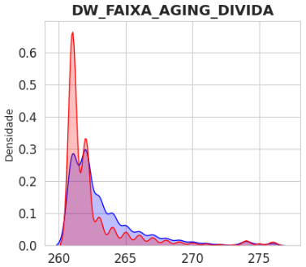
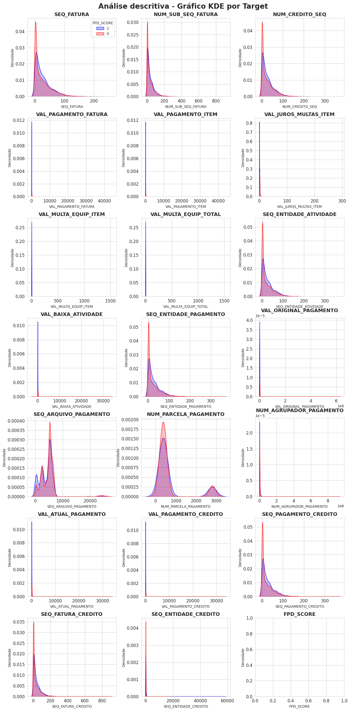
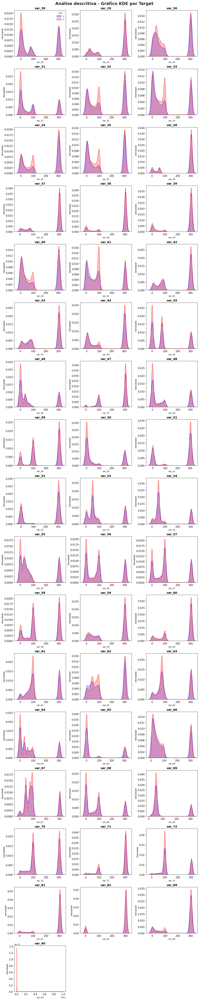
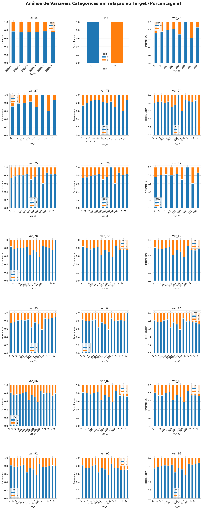

# Insights das Análises Exploratórias

---

## 📊 Base: Dados Cadastrais

**Responsável**: Gabriel Roledo | **Registros**: 3.900.378 | **Variáveis**: 33  
**Notebook**: [eda_cadastrais.ipynb](../notebooks/eda_cadastrais.ipynb) | **Dicionário**: [dicionario_cadastrais.docx](data_dictionary/dicionario_cadastrais.docx)

---

### Visão Geral

A análise foi conduzida a partir de um merge, considerando as variáveis ID (CPF + safra) e FPD_SCORE presentes no FPD da base Bureau. O período analisado compreende out/2024 a mar/2025, totalizando 6 safras.

---

### Qualidade dos Dados

- **CPFs únicos**: 1.272.095 (pós-join)
- **Duplicados**: 18.431 CPFs em múltiplas safras (mesmo cliente, meses diferentes)
- **Nulos críticos**: var_17 (100%), var_02/10/11/14/20/22 (>80%)
- **Padrão**: Ausência de dados correlaciona com maior FPD

---

### Variáveis Destaque

**1. var_08 (Score 0-100)** 
Clara separação FPD=0 vs FPD=1. FPD=1 concentra em valores altos (80-90).

**2. Idade** 
Jovens (18-35): maior risco. Estabiliza após 45 anos. Anomalia aos 60 (aposentados?).  
Média: 42,4 anos

**3. var_15 (UF)**   
MA/CE/RR: ~36% FPD | DF: ~26% FPD | **Δ 10pp regional**

MA, CE e RR aparecem com as maiores proporções de FPD, bem acima da linha de referência (média geral).
Já DF e GO estão entre os menores níveis de FPD, sugerindo performance significativamente melhor do que a média no período analisado.

---

### Outliers Críticos

**var_07**: A "caixa" está totalmente esmagada no zero, com uma linha de outliers que se estende até 30 milhões.
Pode ser uma variável financeira (como renda ou limite) com pouquíssimos valores astronômicos que distorcem a média.
**var_11**: Densa nuvem de outliers

### Perfil Etário no Momento da Proposta

Pico de solicitações: 35-45 anos (~70k por faixa). Anomalia aos 60 anos.

---

### Taxa de inadimplência por safra

Volatilidade Controlada:

A taxa de FPD flutua entre 22,3% e 24,9%.
Embora haja variação, ela ocorre dentro de um intervalo de aproximadamente 2,6 pontos percentuais, indicando uma carteira relativamente estável.

### Anomalias

- **DATADENASCIMENTO**: Min=1900 (default), Max=2015 (menores?)
- **Multicolinearidade**: FLAG_INSTALACAO, PROD, flag_mig2, STATUSRF (correlação ~1.0)

---

### Recomendações

**Remover**: var_17 (100% nulos), FLAG_INSTALACAO, var_06 (constantes)  
**Tratar nulos**: var_04/05 criar categoria "-1"  
**Outliers**: var_07/11/16 log transform ou capping  
**Validação**: Out-of-time obrigatório (safras sequenciais)

---

---

## 📊 Base: Score Bureau Móvel

**Responsável**: Daniel Dayan | **Registros**: 1.290.526 | **Variáveis**: 8
**Notebook**: [eda_bureau_score.ipynb](../notebooks/eda_bureau_score.ipynb) | **Dicionário**: [dicionario_bureau.docx](data_dictionary/dicionario_bureau.docx)

---

### Visão Geral

Base de scores de crédito de bureaus externos. Granularidade: CPF + SAFRA. Target FPD 24% inadimplentes. Período: Out/2024-Mar/2025 (6 safras).

---

### Qualidade dos Dados

- **CPFs únicos**: 1.272.095
- **Duplicados**: 36.379 CPFs em múltiplas safras (mesmo cliente, safras diferentes)
- **Missing values**: ~0,7% em SCORE_01 e 0.04% em SCORE_02
- **Valores suspeitos**: Os valores 0, 1 e 2 aparecem no limite inferior do boxplot, indicando que além dos missing values, esss valores devem ser desconsiderados

---

### Descoberta Principal: Scores com Baixo Poder Preditivo ⚠️

**SCORE_01 e SCORE_02**: Ambos mostram **baixa capacidade discriminatória**

**Observações:**
- Distribuições FPD=0 vs FPD=1 são muito sobrepostas
- Adimplentes têm score ligeiramente maior (esperado)
- Mas diferença é pequena demais para ser preditiva forte
- **Não são variáveis-chave** para o modelo

---

### Variáveis Comportamentais

**Score muda entre safras:**
- Análise de CPFs recorrentes mostra variação nos scores
- Scores capturam **comportamento recente**
- **Recomendação**: Usar última safra para cada CPF

---

### Variáveis para Remover

**3 constantes (cardinalidade = 1):**
- FLAG_INSTALACAO
- PROD
- flag_mig2

**Motivo**: Sem variação = sem poder preditivo. Removê-las reduz processamento.

---

### Sazonalidade

**Taxa de FPD por safra**: Pouca variabilidade entre safras (estável ~24%)

---

### Recomendações

1. **Tratar valores 0,1,2 como missing** (não são scores válidos)
2. **Remover 3 variáveis constantes** antes da modelagem
3. **Usar última safra** para CPFs duplicados
4. **Não depender exclusivamente dos scores** - poder preditivo limitado
5. **Combinar com outras bases** (cadastrais, recarga, telco) para ganho incremental

---
---

## 📊 Base: Book Atraso

**Responsável**: Daniel Dayan | **Registros**: 31.611.316 (transacional) → 1.290.526 (pós-join)  
**Variáveis**: 50 | **Período histórico**: Out/2023 - Mar/2025 (18 meses)  
**Notebook**: [eda_atraso.ipynb](../notebooks/eda_atraso.ipynb) | **Dicionário**: [dicionario_atraso.docx](data_dictionary/dicionario_atraso.docx)

---

### Visão Geral

Base **transacional** de faturas em atraso. Após join com Bureau: 1.290.526 registros. **1 ano de histórico** antes da primeira safra de modelagem (Out/2024).

**Granularidade**: Transação de fatura em atraso (múltiplas linhas por CPF)

---

### Qualidade dos Dados

- **Base transacional**: CPFs aparecem **apenas quando têm fatura em atraso**
- **CPFs duplicados**: Esperado (base transacional)
- **Recorrência máxima**: Cliente aparece em até 18 safras consecutivas (atraso crônico)
- **Missings críticos**: DAT_EXPIRACAO_DW (100%), DAT_CANCELAMENTO_FAT (100%)

---

### Variável-Chave: DW_FAIXA_AGING_DIVIDA 

**Única variável numérica com poder preditivo relevante:**

- Adimplentes têm aging de dívida **menor**
- Inadimplentes têm aging de dívida **maior**
- **Aging** = tempo desde vencimento da fatura

---

### Variáveis Categóricas com Risco Diferenciado

**Plataforma (cod_plataforma):**
- **Alto risco**: M2MS, POSTL, PREPG
- Classificação do perfil: Pós-Pago, Auto-Controle, Pré-pago

**Ponto de Venda:**
- 2 tipos específicos mostram risco maior (Claro já usa para modelagem)

**Observação**: Variabilidade de FPD existe, mas poucas categorias se destacam fortemente.

---

### Análise Temporal

**Histórico disponível**: Out/2023 - Mar/2025

**Padrão identificado:**
- ↑ Contagem de faturas em aberto ao longo do tempo
- ↑ Valor total em aberto aumenta por safra
- **Pico de pagamentos**: Setembro/2024
- **Picos de parcelamento**: Jun/24, Out/24, Dez/24

**Clientes recorrentes:**
- Máximo: 18 aparições (atraso em TODOS os meses)
- Mínimo: 1 aparição (atraso pontual)

---

### Comportamento da Base

**CPF só aparece quando há atraso:**
- Base **NÃO contém** clientes sem atraso
- É um filtro natural de risco
- Combinação com outras bases é essencial

**Estrutura transacional:**
- Múltiplas linhas por CPF
- ID_FATURA pode se repetir com NUM_ENT_SEQ_FATURA diferente
- Mesmo CONTRATO = mesmo DW_NUM_CLIENTE

---

### Outliers Financeiros

**Valores de fatura:**
- Outliers existem (~5% da base)
- São pagamentos reais de alto valor
- Não são erros de sistema

---

### Ideias de Features (Sugeridas na EDA)

**1. Frequência (1, 3, 6, 12 meses):**
- qtd_faturas_em_atraso
- qtd_meses_com_atraso
- taxa_meses_atraso

**2. Valor Financeiro:**
- val_total_em_atraso
- val_medio_fatura_atraso
- val_max_atraso

**3. Aging e Tempo:**
- dias_atraso_medio
- dias_atraso_maximo
- aging_medio_divida

**4. Reincidência:**
- teve_atraso_mes_anterior
- meses_consecutivos_atraso
- flag_atraso_cronico (>12 meses)

---

### Limitações

- **Poder preditivo geral**: Baixo para maioria das variáveis numéricas
- **Exceção**: DW_FAIXA_AGING_DIVIDA
- **Viés de seleção**: Base contém APENAS clientes com histórico de atraso
- **Necessário**: Combinar com bases de comportamento positivo (recarga, telco)

---

### Recomendações

1. **Criar features agregadas** (frequência, valor, aging) por período
2. **Usar histórico completo** (18 meses disponíveis)
3. **Identificar padrões de recorrência** (1 vez vs crônico)
4. **Combinar com outras bases** para balancear viés
5. **Atenção especial**: Plataformas M2MS, POSTL, PREPG

---

---

## 📊 Base: Book Pagamentos

**Responsável**: Daniel Dayan | **Registros**: 21.829.628 (transacional) → 140.606 (pós-filtro)  
**Variáveis**: 73 | **Período histórico**: Out/2023 - Mar/2025 (18 meses)  
**Notebook**: [eda_pagamentos.ipynb](../notebooks/eda_pagamentos.ipynb) | **Dicionário**: [dicionario_pagamentos.docx](data_dictionary/dicionario_pagamentos.docx)

---

### Visão Geral

Base **transacional** de pagamentos de faturas. **1 ano de histórico** antes da primeira safra de modelagem. Complementar ao Book Atraso (mostra comportamento de pagamento).

**Granularidade**: Transação de pagamento (múltiplas linhas por CPF)

---

### Qualidade dos Dados

**Colunas 100% nulas (removidas):**
- Validado: missings na amostra = missings na base completa

**Variáveis com cardinalidade única (remover):**
- Motivo_estorno
- VAL_MULTA_FID_ITEM  
- VAL_DESCONTO_ITEM

**Exceção**: 
- IND_TIPO_CREDITO: Tem missings + categoria "P" → **Manter** (pode indicar comportamento)

**Variáveis duplicadas:**
- VAL_PAGAMENTO_FATURA = VAL_PAGAMENTO_ITEM (estatísticas idênticas)
- VAL_MULTA_EQUIP_ITEM = VAL_MULTA_EQUIP_TOTAL (estatísticas idênticas)

---

### Poder Preditivo: BAIXO ⚠️

**Descoberta principal**: 

> "NENHUMA variável numérica tem grande poder de predição"

**Variáveis categóricas com leve diferenciação:**

| Variável | Categoria | Risco |
|----------|-----------|-------|
| Tipo fatura | 146 | Acima da média |
| Status fatura | Aberto | Acima da média |
| Área | 19, 36 | Acima da média |
| Forma pagamento | 15, PA | Acima da média |
| Banco | 1364, 1423 | Acima da média |
| Tipo pagamento | 30006 | Acima da média |

**Observação**: Diferenças são pequenas. Não há preditores fortes isolados.

---

### Distribuição das Variáveis

**Numéricas:**
- Baixa/média variabilidade
- Concentração à esquerda (assimetria)
- Outliers superiores significativos

**Valores negativos:**
- Presentes em algumas variáveis
- Provável tratamento para missing information

---

### Outliers

**Magnitude**: Até 8% dos dados por variável

**Exemplos extremos:**
- Pagamento de fatura: R$ 44.253,25

**Questão**: São erros ou casos reais extremos?  
**Conclusão da análise**: Provavelmente valores reais (clientes corporativos/VIP)

---

### Análise Temporal

**Período disponível**: Out/2023 - Mar/2025

**Padrões identificados:**

**Frequência categórica:**
- Estável ao longo do tempo
- Volume de dados com tendência de crescimento

**Valores pagos:**
- ↑ Aumento gradual ao longo do tempo
- Picos em meses específicos

**Colunas de Atividade/Crédito:**
- Iniciam apenas em **Mar/2024** (1 ano após início da série)
- Limitação: menos histórico disponível

**Taxa de FPD:**
- Comportamento cíclico constante
- Pico no final da série

---

### Data de Referência para Features

**DAT_STATUS_FATURA**: 
- Range: Out/2023 - Mar/2025
- **Recomendado** para criação de features temporais
- Cobre todo o período de análise

---

### Ideias de Features (Sugeridas)

**1. Frequência de Pagamento:**
- qtd_pagamentos_1m, 3m, 6m, 12m
- taxa_pagamentos_no_prazo
- meses_consecutivos_com_pagamento

**2. Valor Financeiro:**
- val_total_pago_periodo
- val_medio_pagamento
- val_min/max_pagamento

**3. Pontualidade:**
- dias_atraso_medio_pagamento
- flag_sempre_paga_no_prazo
- qtd_pagamentos_antecipados

**4. Padrão de Pagamento:**
- forma_pagamento_predominante
- banco_predominante
- variabilidade_valor_pago

**5. Tipo de Fatura:**
- prop_tipo_146 (alto risco)
- prop_faturas_abertas

---

### Limitações Importantes

1. **Baixo poder preditivo individual**: Variáveis não discriminam bem sozinhas
2. **Viés complementar**: Base mostra APENAS quem paga (complemento do Atraso)
3. **Necessário combinar**: Usar com Atraso + Recarga + Telco para visão completa
4. **Histórico limitado**: Algumas variáveis (atividade/crédito) só após Mar/2024

---

### Recomendações

1. **Criar features agregadas** por períodos (1, 3, 6, 12 meses)
2. **Combinar com Book Atraso** (contrabalancear viés)
3. **Focar em padrões comportamentais** vs valores absolutos
4. **Tratar outliers** com cuidado (podem ser clientes VIP legítimos)

---

---

## 📊 Base: Telco

**Responsável**: Daniel Dayan | **Registros**: 1.290.526 | **Variáveis**: 76 (var_26 a var_93)  
**Período**: Out/2024 - Mar/2025 (6 safras)  
**Notebook**: [eda_telco.ipynb](../notebooks/eda_telco.ipynb) | **Dicionário**: [dicionario_telco.docx](data_dictionary/dicionario_telco.docx)

---

### Visão Geral

Base de **uso e serviços telco** (consumo de dados, voz, SMS, planos, etc.). Variáveis anonimizadas (var_26 a var_93). Target FPD 24% inadimplentes.

**Granularidade**: CPF + SAFRA (6 meses de análise)

---

### Qualidade dos Dados

**Missing pattern consistente:**
- **1.295 linhas** com nulos em TODAS as colunas var_26 a var_93
- Padrão sistemático (não aleatório)
- **Hipótese**: Clientes sem histórico telco ou erro de sistema

**CPFs duplicados:**
- Mesma razão que outras bases: CPF em múltiplas safras
- Ocorre quando cliente assina novo produto/serviço
- **Solução**: Chave CPF + SAFRA

**Consistência do target:**
- FPD idêntico nas bases Score e Telco ✅

---

### Poder Preditivo: MISTO 

**Variáveis Numéricas:** ⚠️ **Baixo poder preditivo**

- Distribuições FPD=0 vs FPD=1 **muito sobrepostas**
- Pouca separação entre classes
- Maioria concentrada em 0, 100 ou 300

**Variáveis Categóricas:** ✅ **POTENCIAL identificado**

**Categorias discriminatórias:**
- Algumas categorias têm **100% target=0** (apenas adimplentes)
- **var_74**: Categoria com **100% target=1** (apenas inadimplentes!) 
- **Alto poder de separação** em variáveis específicas

---

### Distribuição das Variáveis

**Numéricas (var_26 a var_93):**
- Concentração entre 0-100
- Picos em: **0**, **100**, **300**
- **300** pode ser outlier ou código para missing
- var_90: Baixa variabilidade, alguns outliers

**Categóricas:**
- Alta variabilidade entre variáveis
- Algumas com categorias muito discriminatórias

---

### Variável Destaque: var_74

**Descoberta crítica:**
- Possui categoria onde **100% dos clientes são inadimplentes**
- **Poder de separação perfeito** para esse grupo
- Candidata a **variável-chave** do modelo Telco

**Outras variáveis promissoras:**
- Categorias exclusivas de adimplentes (target=0)
- Potencial para regras de negócio

---

### Missing Values: Padrão Sistemático

**1.295 clientes (~0,1%) sem nenhum dado telco:**

**Possíveis razões:**
1. Clientes sem serviço telco ativo
2. Erro de integração de sistemas
3. Clientes recém-migrados (sem histórico)

**Ação recomendada:**
- Criar flag: `sem_historico_telco`
- Avaliar se ausência de dados correlaciona com FPD
- Decidir: imputar ou tratar como categoria separada

---

### Valores Atípicos

**Valor 300:**
- Frequente em várias variáveis
- **Hipótese**: Código para dado faltante ou "não aplicável"
- Investigar dicionário de dados original

**Concentração em 0 e 100:**
- Possível escala percentual (0-100%)
- Ou classificação binária/categórica

---

### Análise Temporal

**Safras**: Out/2024 - Mar/2025 (6 meses)

**Taxa de FPD**: Estável em ~24% ao longo das safras

**Recorrência de CPFs:**
- Clientes aparecem quando há nova assinatura/produto
- Comportamento esperado (não é duplicação)

---

### Limitações

1. **Variáveis anonimizadas**: Dificulta interpretação de negócio
2. **Baixo poder numérico**: Maioria das numéricas não discrimina
3. **Missing sistemático**: 1.295 clientes sem dados
4. **Valor 300**: Incerteza se é outlier ou missing

---

### Pontos Fortes

1. **var_74**: Categoria com 100% inadimplentes (MUITO forte!)
2. **Categorias exclusivas**: Algumas categorias são "puras" (só 0 ou só 1)
3. **Complementaridade**: Adiciona dimensão de uso/serviço às outras bases
4. **Volume**: 1.3M registros (boa cobertura)

---

### Recomendações

1. **Investigar var_74**: Entender o que representa (produto? plano? comportamento?)
2. **Criar regras**: Categorias com 100% target podem virar regras de negócio
3. **Tratar missing pattern**: Flag para 1.295 clientes sem dados
4. **Classificar valor 300**: Confirmar se é missing ou outlier legítimo
5. **Feature engineering**:
   - Flags de categorias de alto risco
   - Combinações de var_74 com outras categóricas
   - Razões entre variáveis numéricas

6. **Modelagem incremental**: Testar ganho específico de var_74 isoladamente

---

---

## 📊 Base: Recarga (Book Recarga)

**Responsável**: Cézar Augusto | **Registros**: 100.213.651 (transacional) → 51.684.470 (pós-join)  
**CPFs distintos**: 3.077.601 (base original) → 1.269.268 (pós-join com Bureau)  
**Período histórico**: Out/2023 - Mar/2025 (18 meses) | **Safras de análise**: 6 (Out/24 - Mar/25)  
**Notebook**: [eda_recarga.py](../notebooks/eda_recarga.py) | **Dicionário**: [dicionario_recarga.docx](data_dictionary/dicionario_recarga.docx)

---

### Visão Geral

Base **transacional massiva** de eventos de recarga pré-pago. **100 milhões de recargas** de **3 milhões de CPFs**. Após join com Bureau: **1,27M CPFs** com FPD identificado.

**Diferencial telco**: Comportamento de consumo real que bureaus tradicionais não capturam.

**Granularidade**: Evento de recarga (múltiplas linhas por CPF × mês)

---

### Cobertura e Volume

**Base original (antes do join):**
- Registros: 100.213.651 eventos de recarga
- CPFs distintos: 3.077.601
- Período: 18 meses (Out/2023 - Mar/2025)
- CPFs nulos: 0 (100% com CPF válido)

**Após join com Bureau:**
- Registros: 51.684.470 eventos (51,5% da base)
- CPFs distintos: 1.269.268 (41,2% dos CPFs originais)
- Safras: 6 (202410, 202411, 202412, 202501, 202502, 202503)
- FPD disponível para 100% dos CPFs

**Agregação final (CPF × mês):**
- 16.282.833 linhas (CPF × ANO_MES)
- 1.269.268 CPFs únicos
- 18 meses distintos (202310 - 202503)
- Média: ~12,8 meses ativos por CPF

---

### Complexidade: CPF × Múltiplos Identificadores

**1. CPF × NUM_CLIENTE (DW_NUM_CLIENTE)**

| Nº clientes/CPF | Qtd CPFs | % |
|-----------------|----------|---|
| 1 | 20.547 | 1,62% |
| 2 | 543.092 | 42,79% |
| 3 | 319.618 | 25,18% |
| 4 | 189.227 | 14,91% |
| 5+ | 196.784 | 15,50% |

**Descoberta crítica**: 
- **98,38% dos CPFs** têm 2+ códigos de cliente distintos!
- Máximo: 36 clientes diferentes para 1 CPF
- **Não é erro**: Representa múltiplos contratos/linhas ao longo do tempo

**2. CPF × NUM_NTC (Número Terminal/Contrato)**

| Nº NTCs/CPF | Qtd CPFs | % |
|-------------|----------|---|
| 1 | 682.785 | 53,79% |
| 2 | 367.468 | 28,95% |
| 3 | 142.757 | 11,25% |
| 4 | 48.938 | 3,86% |
| 5+ | 27.320 | 2,15% |

- **46,21% dos CPFs** usam 2+ NTCs diferentes
- Máximo: 22 NTCs para 1 CPF
- Indica troca de chip, múltiplas linhas, ou portabilidade

**Implicação para modelagem:**
- Agregação por CPF é **obrigatória**
- Relacionamento 1:N complexo
- Features devem capturar diversidade

---

### Variáveis Monetárias

| Variável | Registros | Nulos | Min (R$) | Média (R$) | Max (R$) |
|----------|-----------|-------|----------|------------|----------|
| VAL_CREDITO_INSERIDO | 100.213.651 | 0 | 0,00 | 8,09 | [alto] |
| VAL_BONUS | 100.213.651 | 0 | -87.895,20 | 10.079,38 | [alto] |
| VAL_REAL | 100.213.651 | 0 | -87.895,20 | 10.087,46 | [alto] |
| VALOR_SOS | 6.534.414 | 93.679.237 (93,5%) | 3,00 | 7,55 | [alto] |

**Insights:**
- **Valores negativos** em VAL_BONUS e VAL_REAL: Estornos ou ajustes
- **VALOR_SOS** presente em apenas 6,5% das recargas (emergências)
- Média de recarga: ~R$ 8,09 (crédito puro) / ~R$ 10,00 (com bônus)

---

### Dimensões e Enriquecimento

#### **1. BI_DIM_INSTITUICAO** (Onde recarrega)

**Cobertura**: 1.183.993 CPFs com informação (93,28%)

**Tipo de instituição dominante:**

| Código | Tipo | Qtd CPFs | % |
|--------|------|----------|---|
| 13 | [Tipo 13] | 766.107 | 60,36% |
| 1 | [Tipo 1] | 170.704 | 13,45% |
| 4 | [Tipo 4] | 137.844 | 10,86% |
| 10 | [Tipo 10] | 71.415 | 5,63% |
| SEM_INFO | - | 85.275 | 6,72% |

**Diversidade institucional:**

| Nº tipos/CPF | Qtd CPFs | % |
|--------------|----------|---|
| 1 (Exclusivo) | 399.908 | 31,51% |
| 2 | 445.818 | 35,12% |
| 3 | 248.850 | 19,61% |
| 4+ | 89.417 | 7,04% |

**Insight**: 
- **68,49% dos CPFs** usam 2+ tipos de instituição
- Máxima diversidade: 7 tipos diferentes
- Diversidade pode indicar flexibilidade ou oportunismo

---

#### **2. BI_DIM_TIPO_INSERCAO** (Como recarrega)

**Cobertura**: Apenas 11.132 CPFs com informação (0,88%) ⚠️

**Dominante**: 99,12% classificados como SEM_INFORMACAO

**Dimensão descartada** para análise por baixíssima cobertura.

---

#### **3. BI_DIM_TIPO_RECARGA** (O quê recarrega)

**Cobertura**: 9.756 CPFs com informação (0,77%) ⚠️

**Dominante**: 99,23% classificados como SEM_INFORMACAO

**Dimensão descartada** para análise por baixíssima cobertura.

---

#### **4. BI_DIM_FORMA_PAGAMENTO**

**Cobertura**: 8.634 CPFs com informação (0,68%) ⚠️

**Dominante**: 99,32% SEM_INFORMACAO

**Dimensão descartada** para análise por baixíssima cobertura.

---

#### **5. BI_DIM_CANAL_AQUISICAO_CREDITO**

**Tipo de crédito dominante**: 100% ONLINE

**Diversidade**: 99,9999% dos CPFs usam apenas 1 tipo de crédito

**Dimensão sem variação** - descartada.

---

### Features Criadas (Agregação por CPF)

Com base nos 1.269.268 CPFs, foram criadas features agregadas:

**1. Temporal:**
- Meses ativos (min: 1, máx: 18)
- Primeira recarga (data)
- Última recarga (data)
- Tempo de relacionamento (meses)

**2. Frequência:**
- Total de recargas no período
- Média recargas/mês
- Mediana recargas/mês
- Desvio padrão (regularidade)

**3. Valor:**
- Valor total recarregado
- Valor médio por recarga
- Valor mediano
- Valor máximo/mínimo

**4. SOS (Emergências):**
- Qtd recargas SOS
- % recargas SOS
- Valor médio SOS

**5. Diversidade:**
- Qtd tipos de instituição usados
- Tipo de instituição dominante
- Qtd NUM_CLIENTE distintos
- Qtd NUM_NTC distintos

**6. Regularidade:**
- Coeficiente de variação (CV)
- Gaps entre recargas
- Taxa de recarga mensal

---

### Distribuição de CPFs por Safra (Bureau)

| Safra | CPFs |
|-------|------|
| 202410 | 203.828 |
| 202411 | 227.176 |
| 202412 | 227.985 |
| 202501 | 221.002 |
| 202502 | 203.139 |
| 202503 | 207.396 |

**Estabilidade**: Volume entre 203k-228k CPFs por safra (variação de 11%)

---

**Por quê Recarga é o DIFERENCIAL:**

1. **Comportamento real vs declarado**
   - Bureaus capturam: histórico de crédito, protestos, negativações
   - Recarga capta: consumo efetivo, capacidade de pagamento real

2. **Regularidade como proxy de estabilidade**
   - Recarga mensal consistente → Renda estável
   - Irregularidade alta → Instabilidade financeira
   - Gaps longos → Possível dificuldade

3. **Valor médio ≠ Renda declarada**
   - Mostra capacidade real de pagamento
   - Menos manipulável que dados cadastrais

4. **Diversidade institucional**
   - Múltiplos pontos → Maior engajamento/flexibilidade
   - Ponto único → Comportamento limitado/dependência

5. **Recargas SOS**
   - 6,5% das recargas são emergenciais
   - Alta frequência de SOS → Stress financeiro

---

### Hipóteses de Risco

**ALTO RISCO:**
- Gaps longos sem recarga (>30-60 dias)
- Queda abrupta no valor médio
- % SOS > 15% das recargas
- CV alto (irregularidade)
- Menos de 6 meses ativos no período
- Diversidade institucional = 1 (dependência)

**BAIXO RISCO:**
- Recarga mensal ou quinzenal consistente
- Valor médio estável ou crescente
- % SOS < 5%
- CV baixo (regularidade)
- 12+ meses ativos
- Diversidade institucional ≥ 2

---

### Limitações Identificadas

1. **Dimensões com baixíssima cobertura (<1%)**:
   - Tipo de inserção
   - Tipo de recarga
   - Forma de pagamento
   - **Ação**: Descartadas da análise

2. **Variáveis sem descrição**:
   - Códigos de instituição não mapeados para nomes
   - Requer consulta ao dicionário original da Claro

3. **Complexidade de relacionamento**:
   - 98% dos CPFs com múltiplos NUM_CLIENTE
   - Requer agregação cuidadosa

4. **Viés pré-pago**:
   - Base cobre apenas clientes pré-pagos
   - Não captura comportamento pós-pago

---

### Recomendações para Modelagem

1. **Features de regularidade são críticas**:
   - CV (coeficiente de variação)
   - Gaps entre recargas
   - Frequência mensal

2. **Criar flags de quebra de padrão**:
   - Queda > 30% no valor médio
   - Aumento > 50% em recargas SOS
   - Gap > 2× mediana histórica

3. **Diversidade institucional como proxy de engajamento**:
   - 1 tipo → Risco
   - 2-3 tipos → Normal
   - 4+ tipos → Engajamento alto

4. **Valor absoluto vs relativo**:
   - Testar: Valor médio vs tendência (crescente/decrescente)
   - Tendência pode ser mais preditiva

5. **Modelagem incremental obrigatória**:
   - Isolar ganho de Recarga
   - Testar com/sem outras bases
   - Validar os +10 pontos de KS

6. **Atenção a SOS**:
   - % SOS pode ser forte preditor
   - Valor médio SOS também (emergências maiores = maior stress)

---

 
*Baseado em: eda_recarga.py + incorporacaoDimensoes.docx + inspecaoArquivosDimensoes.docx*

