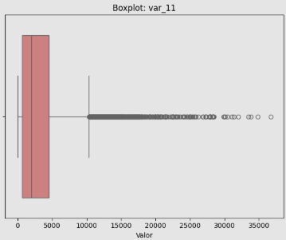
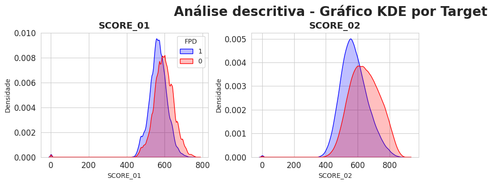

# Insights das Análises Exploratórias

---

## 📊 Base: Dados Cadastrais

**Responsável**: Gabriel Roledo | **Registros**: 3.900.378 | **Variáveis**: 33  
**Notebook**: [eda_cadastrais.ipynb](../notebooks/eda_cadastrais.ipynb) | **Dicionário**: [dicionario_cadastrais.docx](data_dictionary/dicionario_cadastrais.docx)

---

### Visão Geral

A análise foi conduzida a partir de um merge, considerando as variáveis ID (CPF + safra) e FPD_SCORE presentes no FPD da base Bureau. O período analisado compreende out/2024 a mar/2025, totalizando 6 safras.

---

### Qualidade dos Dados

- **CPFs únicos**: 1.272.095 (pós-join)
- **Duplicados**: 18.431 CPFs em múltiplas safras (mesmo cliente, meses diferentes)
- **Nulos críticos**: var_17 (100%), var_02/10/11/14/20/22 (>80%)
- **Padrão**: Ausência de dados correlaciona com maior FPD

---

### Variáveis Destaque

**1. var_08 (Score 0-100)** 
Clara separação FPD=0 vs FPD=1. FPD=1 concentra em valores altos (80-90).

**2. Idade** 
Jovens (18-35): maior risco. Estabiliza após 45 anos. Anomalia aos 60 (aposentados?).  
Média: 42,4 anos

**3. var_15 (UF)**   
MA/CE/RR: ~36% FPD | DF: ~26% FPD | **Δ 10pp regional**

MA, CE e RR aparecem com as maiores proporções de FPD, bem acima da linha de referência (média geral).
Já DF e GO estão entre os menores níveis de FPD, sugerindo performance significativamente melhor do que a média no período analisado.

---

### Outliers Críticos

**var_07**: A "caixa" está totalmente esmagada no zero, com uma linha de outliers que se estende até 30 milhões.
Pode ser uma variável financeira (como renda ou limite) com pouquíssimos valores astronômicos que distorcem a média.
**var_11**: Densa nuvem de outliers

### Perfil Etário no Momento da Proposta

Pico de solicitações: 35-45 anos (~70k por faixa). Anomalia aos 60 anos.

---

### Taxa de inadimplência por safra

Volatilidade Controlada:

A taxa de FPD flutua entre 22,3% e 24,9%.
Embora haja variação, ela ocorre dentro de um intervalo de aproximadamente 2,6 pontos percentuais, indicando uma carteira relativamente estável.

### Anomalias

- **DATADENASCIMENTO**: Min=1900 (default), Max=2015 (menores?)
- **Multicolinearidade**: FLAG_INSTALACAO, PROD, flag_mig2, STATUSRF (correlação ~1.0)

---

### Recomendações

**Remover**: var_17 (100% nulos), FLAG_INSTALACAO, var_06 (constantes)  
**Tratar nulos**: var_04/05 criar categoria "-1"  
**Outliers**: var_07/11/16 log transform ou capping  
**Validação**: Out-of-time obrigatório (safras sequenciais)

---

---

## 📊 Base: Score Bureau Móvel

**Responsável**: Daniel Dayan | **Registros**: 1.290.526 | **Variáveis**: 8
**Notebook**: [eda_bureau_score.ipynb](../notebooks/eda_bureau_score.ipynb) | **Dicionário**: [dicionario_bureau.docx](data_dictionary/dicionario_bureau.docx)

---

### Visão Geral

Base de scores de crédito de bureaus externos. Granularidade: CPF + SAFRA. Target FPD 24% inadimplentes. Período: Out/2024-Mar/2025 (6 safras).

---

### Qualidade dos Dados

- **CPFs únicos**: 1.272.095
- **Duplicados**: 36.379 CPFs em múltiplas safras (mesmo cliente, safras diferentes)
- **Missing values**: ~0,7% em SCORE_01 e 0.04% em SCORE_02
- **Valores suspeitos**: Os valores 0, 1 e 2 aparecem no limite inferior do boxplot, indicando que além dos missing values, esss valores devem ser desconsiderados

---

### Descoberta Principal: Scores com Baixo Poder Preditivo ⚠️

**SCORE_01 e SCORE_02**: Ambos mostram **baixa capacidade discriminatória**

**Observações:**
- Distribuições FPD=0 vs FPD=1 são muito sobrepostas
- Adimplentes têm score ligeiramente maior (esperado)
- Mas diferença é pequena demais para ser preditiva forte
- **Não são variáveis-chave** para o modelo

---

### Variáveis Comportamentais

**Score muda entre safras:**
- Análise de CPFs recorrentes mostra variação nos scores
- Scores capturam **comportamento recente**
- **Recomendação**: Usar última safra para cada CPF

---

### Variáveis para Remover

**3 constantes (cardinalidade = 1):**
- FLAG_INSTALACAO
- PROD
- flag_mig2

**Motivo**: Sem variação = sem poder preditivo. Removê-las reduz processamento.

---

### Sazonalidade

**Taxa de FPD por safra**: Pouca variabilidade entre safras (estável ~24%)

---

### Recomendações

1. **Tratar valores 0,1,2 como missing** (não são scores válidos)
2. **Remover 3 variáveis constantes** antes da modelagem
3. **Usar última safra** para CPFs duplicados
4. **Não depender exclusivamente dos scores** - poder preditivo limitado
5. **Combinar com outras bases** (cadastrais, recarga, telco) para ganho incremental

---

