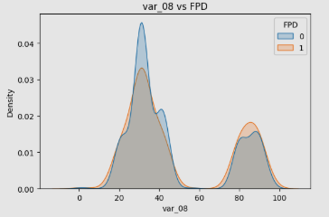
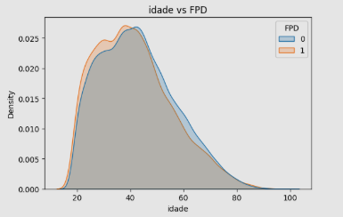
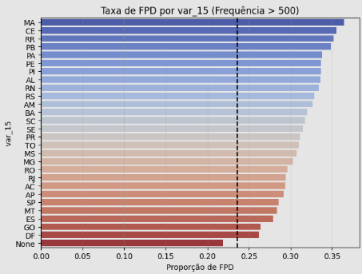
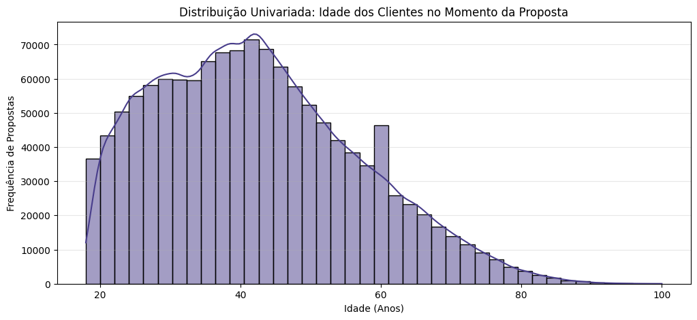
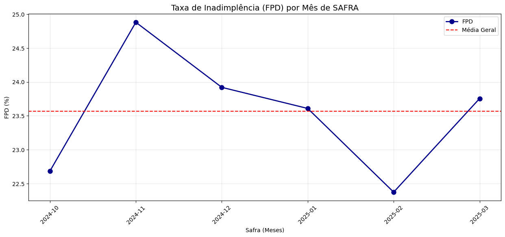

# Insights das Análises Exploratórias

---

## 📊 Base: Dados Cadastrais

**Responsável**: Gabriel Roledo | **Registros**: 3.900.378 | **Variáveis**: 33  
**Notebook**: [eda_cadastrais.ipynb](../notebooks/eda_cadastrais.ipynb) | **Dicionário**: [dict_cadastrais.docx](data_dictionary/dict_cadastrais.docx)

---

### Visão Geral

Usamos um merge para analisar apenas ID (cpf + safra) presentes no FPD da base Bureau. Período: Out/2024-Mar/2025 (6 safras).

---

### Qualidade dos Dados

- **CPFs únicos**: 1.272.095 (pós-join)
- **Duplicados**: 18.431 CPFs em múltiplas safras (mesmo cliente, meses diferentes)
- **Nulos críticos**: var_17 (100%), var_02/10/11/14/20/22 (>80%)
- **Padrão**: Ausência de dados correlaciona com maior FPD

---

### Variáveis Destaque

**1. var_08 (Score 0-100)** 
Clara separação FPD=0 vs FPD=1. FPD=1 concentra em valores altos (80-90).

**2. Idade** 
Jovens (18-35): maior risco. Estabiliza após 45 anos. Anomalia aos 60 (aposentados?).  
Média: 42,4 anos | Mediana: 41 anos

**3. var_15 (UF)**   
MA/CE/RR: ~36% FPD | DF: ~26% FPD | **Δ 10pp regional**

---

### Outliers Críticos

**var_07**: A "caixa" está totalmente esmagada no zero, com uma linha de outliers que se estende até 30 milhões.
Pode ser uma variável financeira (como renda ou limite) com pouquíssimos valores astronômicos que distorcem a média.
**var_11**: Densa nuvem de outliers

### Perfil Etário no Momento da Proposta

Pico de solicitações: 35-45 anos (~70k por faixa). Anomalia aos 60 anos.

---

### Taxa de inadimplência por safra

Volatilidade Controlada:

A taxa de FPD flutua entre 22,3% e 24,9%.
Embora haja variação, ela ocorre dentro de um intervalo de aproximadamente 2,6 pontos percentuais, indicando uma carteira relativamente estável.

### Anomalias

- **DATADENASCIMENTO**: Min=1900 (default), Max=2015 (menores?)
- **Multicolinearidade**: FLAG_INSTALACAO, PROD, flag_mig2, STATUSRF (correlação ~1.0)

---

### Recomendações

**Remover**: var_17 (100% nulos), FLAG_INSTALACAO, var_06 (constantes)  
**Tratar nulos**: var_04/05 criar categoria "-1"  
**Outliers**: var_07/11/16 log transform ou capping  
**Validação**: Out-of-time obrigatório (safras sequenciais)

---

*Atualização: 05/02/2026 | Gabriel Roledo*
